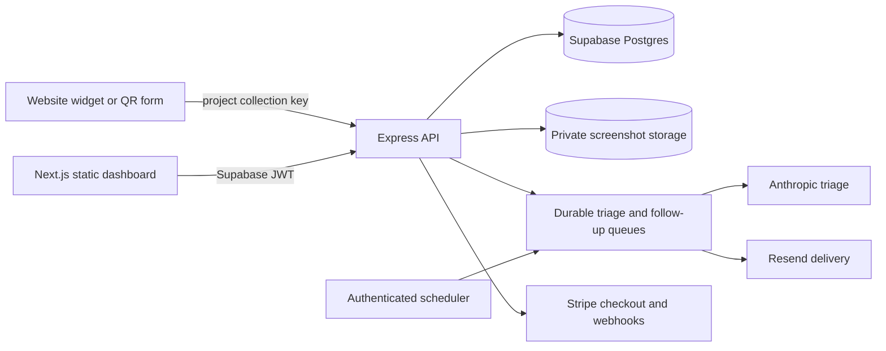

# Grova product and architecture audit

Updated: 2026-07-22

## Executive read

Grova is strongest when it is positioned as a decision system, not a generic
feedback inbox. Its defensible workflow is:

1. Collect a report with useful context.
2. Turn it into scored, grouped evidence.
3. Present the likely cause and next action.
4. Keep a person in control of customer-facing or build-facing actions.
5. Learn from project-specific operating rules over time.

The restart pass aligned the product and implementation around that loop. The
site now has a distinctive editorial/operational design language, the inbox is
a real master-detail decision surface, onboarding verifies ingestion, feedback
loading is bounded, tenant access is centralized, AI and scheduled work are
durable, and previously browser-local operating settings are synchronized.

The verified product build is now deployed to production. Migrations 007–013
were applied transactionally after a rollback preflight, the API is healthy on
Railway, and the exact site build is live on Cloudflare Pages. The remaining
operational work is explicit: provision recurring worker schedules, complete a
real Stripe test checkout and outbound Resend delivery, add observability, and
remove the managed Cloudflare challenge currently applied to HTML requests on
`grova.dev`.

## Canonical source map

| Area | Canonical path | Status |
|---|---|---|
| Site and dashboard | `grova-site` | Active deployment source |
| API and workers | `grova-api` | Active deployment source |
| Old landing experiment | `grova-landing` | Stale; do not deploy |
| Historical checkpoint | `tasks/checkpoint-2026-02-24.md` | Useful history, superseded by this audit |

## Product principles

The overhaul follows the anti-slop design law added from `pols.dev/slop.md`:

- Earn attention with specificity, not decoration.
- Use one clear visual hierarchy instead of walls of interchangeable cards.
- Prefer editorial rows, ledgers, definitions, and decision briefs.
- Use motion to explain state changes, never as ambient ceremony.
- Keep operational labels literal: Resolve, Dismiss, Load more, Check widget.
- Make product claims traceable to working behavior.
- Show uncertainty and partial data instead of implying completeness.

That led to the signature landing-page object—the decision brief—and the
desktop inbox’s ranked queue plus persistent detail pane. Lower landing sections
were changed from icon/card grids to a pipeline, operating steps, definition
rows, and a plan ledger.

## What works now

### Acquisition and setup

- Developer and business positioning share one product thesis while retaining
  track-specific language.
- Pricing claims match implemented capabilities more closely; unimplemented
  auto-send and white-label claims were removed or narrowed.
- Onboarding creates the project and installation snippet, then performs a real
  connection check or controlled API submission before dashboard handoff.
- Widget screenshots and voice capture are opt-in.
- Project keys are generated, rotatable, scoped to one project, and retain a
  24-hour transition window.

### Core workflow

- Feedback is authenticated to an explicit project before protected reads or
  mutations.
- List responses use a bounded page envelope. Dashboard views load more on
  demand and disclose when business calculations use a partial loaded set.
- Developer feedback is ranked into a master-detail decision queue.
- Resolve, dismiss, restore, undo, action history, and follow-up scheduling have
  explicit states.
- Business category configuration and developer product context sync through
  the API instead of disappearing with localStorage or a different device.
- Project scoring weights are persisted, dimension-validated, used by triage,
  and editable for Builder/Agency projects.

### AI and automation

- Model output is schema-validated and scores are clamped.
- Missing score dimensions contribute zero instead of inflating confidence.
- Project context is included as untrusted data, not system instruction.
- AI triage uses a durable database queue with bounded claims, stale-lock
  recovery, three attempts, and authenticated worker execution.
- Private screenshots can be retrieved by the worker for multimodal triage.
- Weekly digests are idempotent by project and complete UTC week.
- Follow-ups use durable claims and delivery state rather than an in-process
  timer.
- Customer-facing actions remain human-reviewed. The unused auto-send setting
  is no longer exposed.

### Tenancy and security

- Project authorization is centralized for owners and accepted organization
  members.
- Shared-project writes are role-aware; members can read while owners/admins
  manage settings, invitations, and keys.
- Organization invitations use random, expiring, hashed, email-bound tokens.
- Screenshots are stored in a private bucket and returned through signed URLs.
- Resend and Stripe webhooks verify raw signed payloads.
- Stripe checkout accepts known tier names only and rejects tiers from the wrong
  product track.
- Stripe period handling supports the current SDK’s item-level period fields.
- Stripe event audit rows are unique and duplicate deliveries are acknowledged.
- Widget configuration, email template variables, URLs, colors, sender names,
  and custom bodies are sanitized at output boundaries.
- Historical direct-browser project and organization RLS policies are closed;
  the API is the authorization boundary.
- Missing production email or core service configuration fails closed.
- Both production dependency graphs currently report zero known vulnerabilities.

## Architecture

The static site owns presentation and client state. The API owns authorization,
entitlements, data validation, external side effects, and durable work. Supabase
Auth proves identity; browser clients do not query protected application tables
directly.

### Important boundary decisions

- Collection keys identify a destination but are not dashboard credentials.
- JWT users receive project access through ownership or accepted organization
  membership.
- The global API key is administrative and must never be embedded in the site.
- Model calls and email sends happen behind claimable jobs or explicit user
  actions.
- Project preferences are data, not local UI settings.

## Verification evidence

At the end of this pass:

- API: 15 suites, 80 tests passing.
- Site: TypeScript passes.
- Site: ESLint passes with zero warnings.
- Site: 27-route Next.js production export passes.
- Widget scripts: Node syntax checks pass.
- API scripts and source: Node syntax checks pass.
- API and site production audits: 0 known vulnerabilities.
- Supabase migrations 007–013 passed a rollback preflight and then committed in
  one production transaction; post-migration constraints, policies, functions,
  tables, columns, and row counts were verified.
- Railway production deployment `851367c2-8486-465b-9f03-4f0508e9802e` is
  running API commit `a4ee086`; health, authenticated empty-queue worker calls,
  authorization rejection, and signed Resend webhook handling passed.
- Cloudflare Pages production deployment
  `ddf59813-65d7-4015-a759-ea5f6463ee0a` is running site commit `beb76a3`;
  its home, demo inbox, and widget routes return 200.
- Rendered landing pages were inspected at 1440×1000 and 390×844 in both product
  tracks and both themes. The populated demo inbox, docs route, theme control,
  track control, cookie consent, feedback widget, and demo navigation were
  exercised with real clicks.
- The mobile document width matched the viewport, live text was not clipped,
  the hero owned the first frame, and the widget cleared the cookie/footer
  controls.

Performance trace capture remains a follow-up because the Chrome DevTools MCP
is not configured in this workspace. This is an explicit gap, not a silent pass.

## Production rollout status

- Complete: permission-restricted logical Supabase backup at
  `/tmp/grova-production-backup-2026-07-22.json`.
- Complete: target project confirmation and migrations 007–013.
- Complete: required production secrets, including `CRON_SECRET` and the
  existing Resend webhook signing secret.
- Complete: API deploy, health check, queue endpoint checks, signed webhook
  check, and private screenshot-bucket verification.
- Complete: exact verified site export deployed to Cloudflare Pages.
- Pending: recurring schedules for triage every minute, follow-ups hourly, and
  digest weekly after the UTC week closes. Digest execution can send live
  customer email and was deliberately not invoked as a smoke test.
- Pending: one controlled developer and business ingestion journey against live
  accounts, one Stripe test checkout with duplicate webhook replay, and one
  outbound Resend action with delivery-state confirmation.
- Pending: replace the current managed challenge on `grova.dev` HTML requests
  with a narrow, evidence-based edge rule. The immutable Pages production URL
  is healthy while the custom domain challenge is investigated.

The production deployment currently runs the reviewed commits from the draft
PRs. Merge them before the next Git-connected deployment so the default branch
cannot later redeploy an older application revision.

## Next product bets

### P1: make the signal compound

- Server-side analytics aggregates so long-history business charts never depend
  on how many pages a browser loaded.
- Similar-feedback clustering with a visible evidence trail and reversible
  merge/split controls.
- A lifecycle beyond pending/resolved: investigating, planned, shipped, and
  customer-notified.
- Saved views for “new since last visit,” high-severity regressions, and repeated
  revenue blockers.

### P1: finish multi-user operations

- Team/invitation UI over the completed organization API.
- Activity log for settings, key rotation, triage rule changes, and actions.
- Normalize billing to an account or organization subscription instead of
  treating a project row as the long-term billing account.
- Explicit owner transfer and organization deletion workflows.

### P2: close the build loop

- GitHub/Linear issue creation from an approved decision brief.
- A small editor extension only after the API contract proves useful without it.
- Webhooks for feedback.created, triage.completed, decision.resolved, and
  action.delivered.
- Import/backfill for existing support channels with deduplication.

### P2: trust and operability

- Queue depth, oldest-job age, worker failure rate, webhook failure rate, and
  delivery SLO dashboards.
- Automated database migration validation in an ephemeral Postgres/Supabase CI
  environment.
- Browser E2E coverage for signup → project → test feedback → triage → resolve.
- A real mobile browser matrix and a DevTools performance budget for landing,
  dashboard, and widget interaction.

## Design ideas worth exploring

- Keep the decision brief as the brand’s primary visual asset across landing,
  onboarding, empty states, and generated issue output.
- Let teams compare “why this ranked” against their stored operating rules.
- Turn clusters into compact evidence dossiers rather than charts by default.
- Give business users a weekly owner’s brief: three facts, one risk, one action.
- Use density controls for operational surfaces, not cosmetic theme variants.
- Make the widget visually quiet until invoked; preserve host-page typography
  and avoid promotional motion.

## Deliberate non-goals

- Automatic refunds or automatic customer email sends.
- A broad all-purpose support desk.
- Per-seat complexity before team collaboration earns it.
- Decorative dashboard metrics that do not change a decision.
- Shipping the stale `grova-landing` repository.
