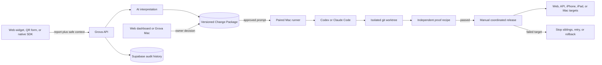

# Grova product and architecture audit

Updated: 2026-07-22

## Executive read

Grova is strongest when it is positioned as a decision system, not a generic
feedback inbox. Its defensible workflow is:

1. Collect a report with useful context.
2. Turn it into scored, grouped evidence.
3. Present the likely cause and next action.
4. Keep a person in control of customer-facing or build-facing actions.
5. Learn from project-specific operating rules over time.

The restart pass now carries that loop through code delivery. Reports capture
safe browser, device, build, route, console, and network context. Grova turns
the evidence into a versioned Change Package. An owner or admin can approve it
for Codex or Claude Code, either as an interactive handoff or through a paired
Mac runner. The runner works in isolated git worktrees, accepts only structured
agent output, runs independent proof, and creates a release candidate only when
every required check passes. Release remains a separate manual decision across
every affected product surface.

The overhaul is implemented and verified locally. Production migrations
007–016 are applied and verified. The new API and site builds are ready for
rollout after the previously exposed Supabase service credential is rotated.
That credential rotation is a release gate, not a documentation follow-up.

## Canonical source map

| Area | Canonical path | Status |
|---|---|---|
| Site and dashboard | `grova-site` | Active deployment source |
| API and workers | `grova-api` | Active deployment source |
| Old landing experiment | `grova-landing` | Stale; do not deploy |
| Historical checkpoint | `tasks/checkpoint-2026-02-24.md` | Useful history, superseded by this audit |

## Product principles

The overhaul follows the anti-slop design law added from `pols.dev/slop.md`:

- Earn attention with specificity, not decoration.
- Use one clear visual hierarchy instead of walls of interchangeable cards.
- Prefer editorial rows, ledgers, definitions, and decision briefs.
- Use motion to explain state changes, never as ambient ceremony.
- Keep operational labels literal: Resolve, Dismiss, Load more, Check widget.
- Make product claims traceable to working behavior.
- Show uncertainty and partial data instead of implying completeness.

That led to the signature landing-page object—the decision brief—and the
desktop inbox’s ranked queue plus persistent detail pane. Lower landing sections
were changed from icon/card grids to a pipeline, operating steps, definition
rows, and a plan ledger.

### Anti-slop point-by-point recheck

The final UI pass re-read the full design law and checked every listed failure
mode. The applicable findings are grouped here so exceptions remain explicit:

- Composition: the landing page is built around Grova's populated decision
  brief, not a split SaaS hero, fake app window, feature-card row, generic CTA
  slab, pricing highlight preset, testimonial card, or standard footer stack.
  The dashboard is an operational queue and evidence dossier, not a card-grid
  reskin.
- Palette and atmosphere: the system holds one quiet mineral-green, rust, black,
  and lichen-white palette. It has no blue-purple, candy, aurora, radial halo,
  cut-off glow, banded gradient, full-page graph paper, or cool slate default.
  Grain remains on the page substrate behind live content.
- Type: Sentient is the single character display face, with the system sans as
  the workhorse and system mono reserved for real code. Microcopy was raised to
  0.68rem and tracking reduced so labels remain readable. There is no gradient
  headline, cramped display statistic, all-caps label costume, default Google
  tech stack, or decorative quote glyph.
- Geometry and depth: the decision brief owns one deliberate clipped corner and
  pads content clear of it. Controls and evidence panels use restrained tonal
  surfaces. There are no icon tiles, faux shadow boxes, kitchen-sink cards,
  default floating cards, glow borders, or symmetric cloud shadows. Rounded
  status shapes remain only where containment communicates state.
- Alignment and edges: desktop navigation, project selection, primary tabs,
  theme, refresh, and sign-out share one row. The inbox title, stage filters,
  counts, and refresh share one contextual row. Mobile keeps the stage row
  scrollable, hides redundant statistics, uses queue-to-detail drill-in, and
  gives every text block a real gutter. Screenshots confirmed no shaved text,
  ragged action rows, off-center controls, or unintended section overlap.
- Motion: visible content never starts at opacity zero. Landing track changes
  and onboarding steps move already-visible content; optional dashboard details
  now render directly when opened instead of depending on a height/opacity
  reveal. Buttons do not jump, scale, glow, or animate underlines. Reduced-motion
  rules collapse every remaining transition.
- Controls: project selection, theme, stage tabs, provider and handoff selectors,
  dismiss confirmation, mobile back, Settings, and Smart Actions were clicked
  in the browser. No dead control, stranded loading label, or console warning
  remained. Focus-visible state and skip navigation are present.
- Content and legitimacy: product examples use Grova-specific reports, proof
  criteria, surfaces, providers, and release states. There are no invented
  customer logos, fake company claims, fake countdowns, placeholder dashboards,
  or decorative integrations. Icons are bare marks where needed and absent
  where words are clearer.

The deliberate exceptions are functional: status labels can use compact
contained shapes; true code and commit hashes use mono; scrollable operational
lists use overflow; skeletons use a faint directional sweep while data is
actually pending. None gates readable content or imitates a marketing effect.

## What works now

### Acquisition and setup

- Developer and business positioning share one product thesis while retaining
  track-specific language.
- Pricing claims match implemented capabilities more closely; unimplemented
  auto-send and white-label claims were removed or narrowed.
- Onboarding creates the project and installation snippet, then performs a real
  connection check or controlled API submission before dashboard handoff.
- Widget screenshots and voice capture are opt-in.
- Project keys are generated, rotatable, scoped to one project, and retain a
  24-hour transition window.

### Core workflow

- Feedback is authenticated to an explicit project before protected reads or
  mutations.
- List responses use a bounded page envelope. Dashboard views load more on
  demand and disclose when business calculations use a partial loaded set.
- Developer feedback is ranked into a master-detail decision queue.
- Resolve, dismiss, restore, undo, action history, and follow-up scheduling have
  explicit states.
- Business category configuration and developer product context sync through
  the API instead of disappearing with localStorage or a different device.
- Project scoring weights are persisted, dimension-validated, used by triage,
  and editable for Builder/Agency projects.
- Developer reports become immutable, versioned Change Packages containing the
  interpreted problem, affected surfaces, risk, constraints, acceptance
  criteria, proof recipe, and provider-ready prompt.
- Approval supports Codex and Claude Code. Interactive mode opens or copies the
  approved prompt without sending it silently. Automated mode queues work for a
  paired runner owned by the same developer.
- One project can describe distinct web, mobile web, iPhone, iPad, Mac, and API
  surfaces, each with its own repository root, build target, verification
  commands, protected paths, release channels, and deployment recipe.
- Release approval is independent of code approval. Only the exact proven
  commit can ship, every affected surface must be included, failed targets stop
  queued siblings, retry preserves earlier attempts, and rollback is explicit.

### AI and automation

- Model output is schema-validated and scores are clamped.
- Missing score dimensions contribute zero instead of inflating confidence.
- Project context is included as untrusted data, not system instruction.
- AI triage uses a durable database queue with bounded claims, stale-lock
  recovery, three attempts, and authenticated worker execution.
- Private screenshots can be retrieved by the worker for multimodal triage.
- Weekly digests are idempotent by project and complete UTC week.
- Follow-ups use durable claims and delivery state rather than an in-process
  timer.
- Customer-facing actions remain human-reviewed. The unused auto-send setting
  is no longer exposed.
- Coding-agent work runs in isolated worktrees with a sanitized environment.
  Free-form prose cannot be mistaken for successful structured output.
- Verification executes outside the coding agent and records commands, output,
  artifacts, commit mappings, and proof status before release is possible.
- The launchd-capable local runner discovers both installed Codex and Claude
  Code binaries and can remain available without keeping a terminal open.

### Tenancy and security

- Project authorization is centralized for owners and accepted organization
  members.
- Shared-project writes are role-aware; members can read while owners/admins
  manage settings, invitations, and keys.
- Organization invitations use random, expiring, hashed, email-bound tokens.
- Screenshots are stored in a private bucket and returned through signed URLs.
- Resend and Stripe webhooks verify raw signed payloads.
- Stripe checkout accepts known tier names only and rejects tiers from the wrong
  product track.
- Stripe period handling supports the current SDK’s item-level period fields.
- Stripe event audit rows are unique and duplicate deliveries are acknowledged.
- Widget configuration, email template variables, URLs, colors, sender names,
  and custom bodies are sanitized at output boundaries.
- Historical direct-browser project and organization RLS policies are closed;
  the API is the authorization boundary.
- Missing production email or core service configuration fails closed.
- Both production dependency graphs currently report zero known vulnerabilities.
- Collection keys can submit and identify a project but cannot approve code,
  pair a runner, release a build, retry deployment, or request rollback.
- Runner and desktop tokens are hashed at rest, scoped to one owner, revocable,
  and split by capability so a desktop review client is not a job runner.

## Architecture

The static site and native Mac app own presentation and developer decisions.
The API owns authorization, validation, lifecycle transitions, and immutable
audit history. The local runner owns on-device repositories, coding-agent
processes, proof commands, deployment commands, and rollback commands. Supabase
Auth proves identity; browser clients do not query protected application tables
directly.

### Important boundary decisions

- Collection keys identify a destination but are not dashboard credentials.
- JWT users receive project access through ownership or accepted organization
  membership.
- The global API key is administrative and must never be embedded in the site.
- Model calls and email sends happen behind claimable jobs or explicit user
  actions.
- Project preferences are data, not local UI settings.
- Approval, proof, and release are three separate gates.
- A coding agent never receives production deployment authority.
- Deployment records snapshot the proven commit and exact release recipe so a
  later settings edit cannot change work already approved.

## Verification evidence

At the end of this pass:

- API: 21 suites, 102 tests passing.
- Local runner: 6 tests passing, including structured output, worktree escape,
  proof, deployment, provider discovery, and launchd XML safety.
- Site: TypeScript and ESLint pass with zero warnings.
- Site: all 27 routes pass the optimized Next.js production build.
- GrovaFeedbackKit: 2 Swift tests pass for scalar context encoding and sensitive
  route-query redaction.
- Native Grova Mac app: Xcode macOS build succeeds.
- Supabase migration 016 passes compilation plus a real rollback-only behavior
  scenario proving that a failed attempt stays in history while its successful
  retry advances the release and change to deployed.
- Production tables, columns, claim functions, and four atomic release
  functions were verified after migrations 014–016.
- The local runner doctor finds Codex CLI 0.144.1 and Claude Code 2.1.138.
- The pre-overhaul Railway and Cloudflare deployments remain the production
  baseline until credential rotation and the rollout below are complete.
- The dashboard was exercised with real browser clicks in dark and light modes
  at desktop and 430px mobile widths. Project switching, stage filtering,
  Codex/Claude selection, local/interactive handoff, dismiss confirmation,
  mobile drill-in/back, theme control, Settings, and legacy Smart Actions all
  responded without console errors.
- Repeated checks found no visible `Loading` label in the project selector,
  change queue, or expanded Smart Actions panel. The project-store reload loop
  and active-object dependency that caused the flicker were removed.

Performance trace capture remains a follow-up because the Chrome DevTools MCP
is not configured in this workspace. This is an explicit gap, not a silent pass.

## Production rollout status

- Complete: permission-restricted logical Supabase backup at
  `/tmp/grova-production-backup-2026-07-22.json`.
- Complete: target project confirmation and migrations 007–016.
- Complete: required production secrets, including `CRON_SECRET` and the
  existing Resend webhook signing secret.
- Pending: rotate the exposed Supabase service credential, update Railway, and
  prove database-backed health before revoking the old key.
- Pending: deploy the reviewed API and site branches, then repeat production
  health, authorization, route, and browser smoke checks.
- Pending: pair the local runner and native Mac review app, map all Grova and
  TradeOS surface roots, install the launchd runner service, and exercise one
  controlled end-to-end change with a harmless test repository.
- Pending: recurring schedules for triage every minute, follow-ups hourly, and
  digest weekly after the UTC week closes. Digest execution can send live
  customer email and was deliberately not invoked as a smoke test.
- Pending: one controlled developer and business ingestion journey against live
  accounts, one Stripe test checkout with duplicate webhook replay, and one
  outbound Resend action with delivery-state confirmation.
- Pending: replace the current managed challenge on `grova.dev` HTML requests
  with a narrow, evidence-based edge rule. The immutable Pages production URL
  is healthy while the custom domain challenge is investigated.

The production application still needs the reviewed overhaul branches. Merge
them after the production smoke test so the default branch cannot later
redeploy an older application revision.

## Next product bets

### P1: make the signal compound

- Server-side analytics aggregates so long-history business charts never depend
  on how many pages a browser loaded.
- Similar-feedback clustering with a visible evidence trail and reversible
  merge/split controls.
- A lifecycle beyond pending/resolved: investigating, planned, shipped, and
  customer-notified.
- Saved views for “new since last visit,” high-severity regressions, and repeated
  revenue blockers.

### P1: finish multi-user operations

- Team/invitation UI over the completed organization API.
- Activity log for settings, key rotation, triage rule changes, and actions.
- Normalize billing to an account or organization subscription instead of
  treating a project row as the long-term billing account.
- Explicit owner transfer and organization deletion workflows.

### P2: extend the build loop

- GitHub/Linear issue creation as an optional output from the same approved
  Change Package, never as a parallel source of truth.
- Signed build and TestFlight adapters after command recipes prove reliable on
  controlled iPhone, iPad, and Mac releases.
- Webhooks for feedback.created, triage.completed, decision.resolved, and
  action.delivered.
- Import/backfill for existing support channels with deduplication.

### P2: trust and operability

- Queue depth, oldest-job age, worker failure rate, webhook failure rate, and
  delivery SLO dashboards.
- Automated database migration validation in an ephemeral Postgres/Supabase CI
  environment.
- Browser E2E coverage for signup → project → test feedback → triage → resolve.
- A real mobile browser matrix and a DevTools performance budget for landing,
  dashboard, and widget interaction.

## Design ideas worth exploring

- Keep the decision brief as the brand’s primary visual asset across landing,
  onboarding, empty states, and generated issue output.
- Let teams compare “why this ranked” against their stored operating rules.
- Turn clusters into compact evidence dossiers rather than charts by default.
- Give business users a weekly owner’s brief: three facts, one risk, one action.
- Use density controls for operational surfaces, not cosmetic theme variants.
- Make the widget visually quiet until invoked; preserve host-page typography
  and avoid promotional motion.

## Deliberate non-goals

- Automatic refunds or automatic customer email sends.
- A broad all-purpose support desk.
- Per-seat complexity before team collaboration earns it.
- Decorative dashboard metrics that do not change a decision.
- Shipping the stale `grova-landing` repository.
